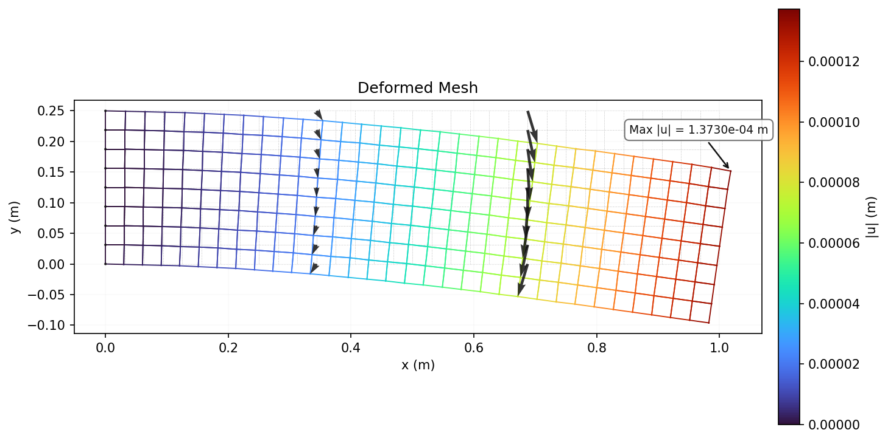
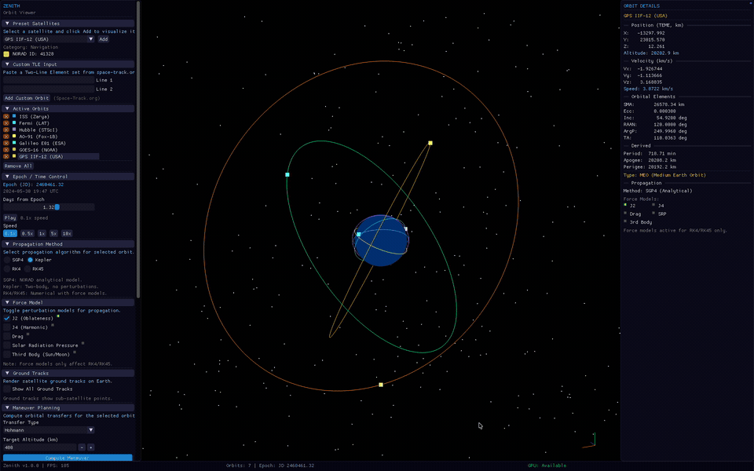

  

I'm a Mechanical Engineering graduate with hands-on experience building high-performance C++ physics solvers, flight dynamics pipelines, and spacecraft GNC systems.

My work covers computational fluid dynamics, finite element analysis, orbital propagation, and attitude determination and control.

  
  
  
  
  

---

<!-- Featured Projects -->

  

<table>
<tr>
<td width="33%" align="center">

### [AK-Vortex](https://github.com/ajeet-krish/AK-Vortex)
**C++ Lattice Boltzmann CFD Solver**

`C++` `Python` `Rust`

MRT collision · Smagorinsky LES · Bouzidi bounce-back · AMR

</td>
<td width="33%" align="center">

### [Crucible-FEA](https://github.com/ajeet-krish/Crucible-FEA)
**C++ Finite Element Structural Solver**

`C++` `Python`

6 element types · Cholesky + CG solvers · Adaptive refinement

</td>
<td width="33%" align="center">

### [Zenith](https://github.com/ajeet-krish/zenith)
**Orbital Propagation & Flight Dynamics Engine**

`C++` `Python`

SGP4/SDP4 propagation · Force models · Conjunction assessment

</td>
</tr>
</table>

---

<!-- Project Catalog -->

  

<b>CFD & Aerodynamics</b> (3 projects)

 

| Project | Tech | Summary |
|---------|------|---------|
| [AK-Vortex](https://github.com/ajeet-krish/AK-Vortex) | `C++` `Rust` `Python` | LBM CFD solver with MRT, LES, AMR, Rust desktop app, PINN surrogate |
| [Airfoil CFD Explorer](https://github.com/ajeet-krish/Airfoil_CFD) | `Python` `SU2` `Gmsh` | Automated RANS pipeline with NACA 0012 validation and CST shape optimization |
| [The Aerodynamics of Soccer](https://github.com/ajeet-krish/Soccer-CFD) | `Python` `PhiFlow` `SU2` | Magnus effect, vortex shedding, wake drafting, tactical formation flow |

<b>FEA & Structural Analysis</b> (1 project)

 

| Project | Tech | Summary |
|---------|------|---------|
| [Crucible-FEA](https://github.com/ajeet-krish/Crucible-FEA) | `C++` `Python` | 6-element FEA solver with nonlinear dynamics, contact, desktop app |

<b>CAD & Mechanical Design</b> (1 project)

 

| Project | Tech | Summary |
|---------|------|---------|
| [Piston-Crankshaft CAD](https://github.com/ajeet-krish/piston-crankshaft-cad) | `Fusion 360` `FreeCAD` `GD&T` | 4-piston inline assembly with ASME Y14.5 tolerancing, FEA validation, DFM analysis |

<b>Flight Dynamics & GNC</b> (3 projects)

 

| Project | Tech | Summary |
|---------|------|---------|
| [Zenith](https://github.com/ajeet-krish/zenith) | `C++` `Python` | SGP4/SDP4 propagation, force models, conjunction assessment, GPU acceleration |
| [AstroSim](https://github.com/ajeet-krish/AstroSim) | `C++` `Python` | ADCS simulator with sensor models, EKF attitude determination, FDIR |
| [SwarmGNC](https://github.com/ajeet-krish/SwarmGNC) | `C++` `Python` `Rust` | 7-drone swarm, LQR, APF, FDIR, Rust GCS |

---

<!-- Tech Stack -->

  

| Domain | Technologies |
|--------|-------------|
| **CAD/CFD** | SolidWorks · ANSYS · SU2 · OpenFOAM · ParaView |
| **Languages** | C++ · Python · Rust · MATLAB |
| **GNC & Orbital** | SGP4/SDP4 · EKF · LQR · ADCS · Monte Carlo · State-Space Dynamics |
| **HPC** | OpenMP · Apple Metal GPU |
| **ML/AI** | PyTorch · Physics-Informed Neural Networks |
| **Manufacturing** | CNC Machining · 3D Printing · Lathe/Mill Operations · MIG Welding |

---

<!-- Build Status -->

  

| Project | CI | Tests | Platform |
|---------|-----|-------|----------|
| AK-Vortex |  | 26 | Ubuntu + macOS |
| Crucible-FEA |  | 57 | Ubuntu + macOS |
| Zenith |  | 139 | Ubuntu + macOS |
| AstroSim |  | 199 | Ubuntu + macOS |
| SwarmGNC |  | 96 | Ubuntu + macOS |

---

<!-- Let's Connect -->

  

  
  
  

  <i>Always open to discussing new opportunities, collaborations, or engineering problems.</i>

